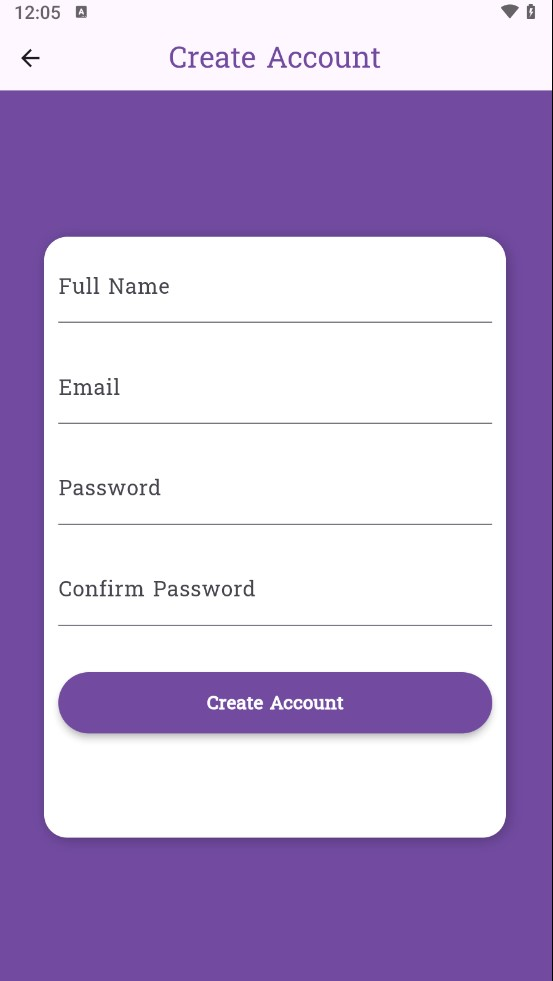
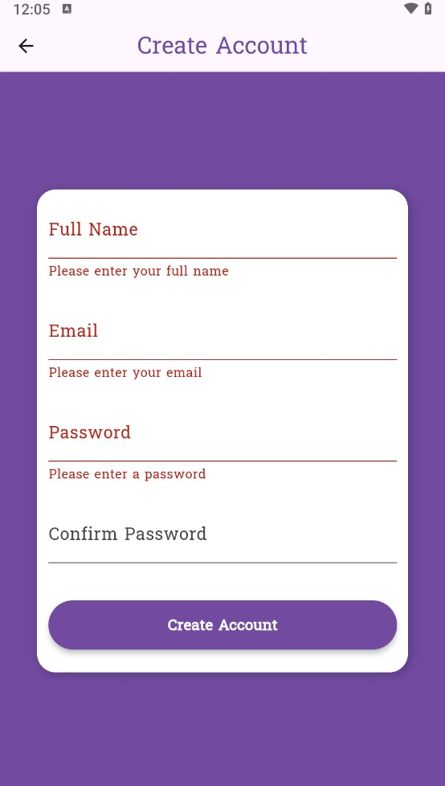
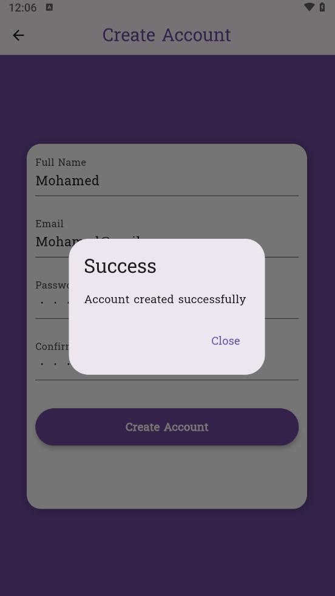

# Resto

First GitHub Flutter project.

## Project overview

This is a Flutter application built using the Dart framework.  
It provides a simple starting point for building cross-platform mobile apps for Android and iOS with a clean architecture.
The app is small shop for some electronics items that we need currently years

## Features 

■ Simple - Static Intro Widget

■ Animated Navigation - which is fade In & Out, It works when you signup in the app

■ Cross-Platform - works on Android and iOS  

■ Clean & Aesthetic UI — modern design with a focus on simplicity

## Setup Instructions 

■ Install [Flutter SDK](https://docs.flutter.dev/get-started/install) (latest stable version)

■ Install [Dart](https://dart.dev/get-dart)

■ Install [Android Studio](https://developer.android.com/studio) or [Visual Studio Code](https://code.visualstudio.com/)

##  Screenshots

  
  
  

Thanks fot your time :)
